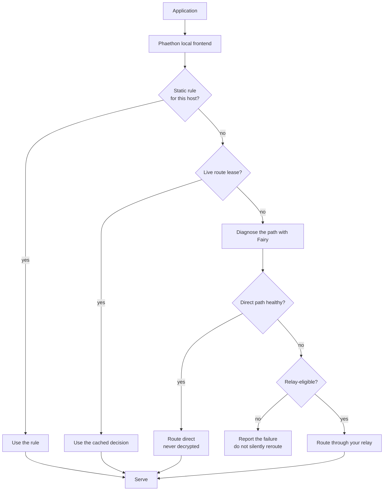
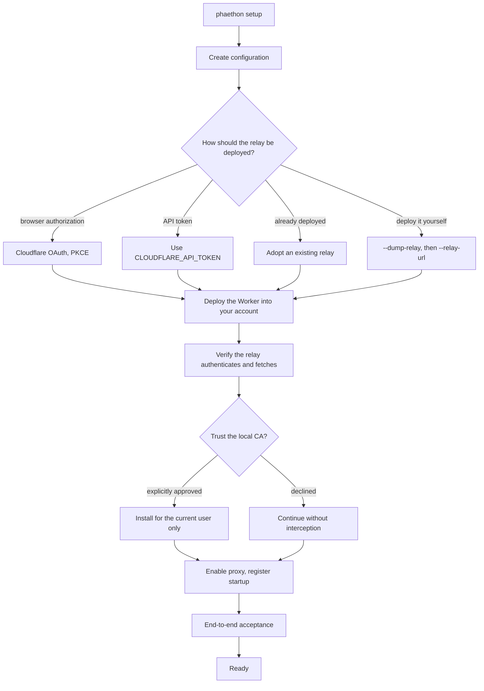

<p align="center">
  
</p>

<p align="center">
  
  
</p>

<p align="center">
  <strong>Keep healthy traffic direct. Relay only what actually needs help.</strong>
</p>

<p align="center">
  
  
  
  
</p>

<p align="center">
  <a href="#quickstart">Quickstart</a> ·
  <a href="docs/ARCHITECTURE.md">Architecture</a> ·
  <a href="docs/ROUTING.md">Routing</a> ·
  <a href="docs/TCP-EGRESS.md">TCP egress</a> ·
  <a href="docs/SSH.md">SSH</a> ·
  <a href="docs/TAILSCALE.md">Tailscale</a> ·
  <a href="docs/TRUST-AND-SECURITY.md">Security</a>
</p>

---

Phaethon is a local selective routing plane. It measures whether a destination
is reachable directly, keeps the traffic direct when it is, and routes only the
destinations that are blocked, intercepted or degraded through a relay that
belongs to you.

It is not a VPN. It does not tunnel your machine. Most of your traffic never
touches it.

## Why it exists

Network tooling tends to pick one of two positions:

1. send **everything** through a tunnel, whether it needs it or not, or
2. assume the network is honest.

Neither is true on a filtered network. Some destinations work perfectly; some
are intercepted, blackholed, or broken on one port while another port on the
same host is fine. Phaethon measures which is which and acts only where it must.

The consequence is the design constraint everything else follows from: **direct
traffic is never decrypted.** Only a destination Phaethon has decided to relay
has its TLS terminated, and there has to be a reason for that decision.

## What it does

| Capability | What it means |
| --- | --- |
| **Selective HTTP routing** | A local HTTP proxy on `127.0.0.1:8377` that decides per destination |
| **Path diagnosis** | Asks Fairy — DNS, TCP, TLS — what is actually wrong, once, and remembers |
| **Short-lived leases** | A decision is cached for minutes, not forever, so a network change is noticed |
| **Relay** | Provisioned into **your** Cloudflare account, allowlisted server-side |
| **TCP egress** | Authenticated, policy-constrained TCP through SOCKS5 or HTTP CONNECT |
| **SSH over TCP egress** | Real OpenSSH through the relay, via `ProxyCommand` |

## Architecture



A static rule always wins. A lease is a remembered decision with a short life.
Fairy is consulted once per unknown destination, not per request — the hot path
is a map lookup. Full detail in [docs/ROUTING.md](docs/ROUTING.md).

## What Phaethon is not

- **Not a VPN.** There is no TUN device, no route capture, no WireGuard.
- **Not a full-tunnel proxy.** Direct traffic bypasses it entirely.
- **Not a bypass for everything.** It carries an explicit allowlist through your
  own account. If your network blocks the relay endpoint, Phaethon cannot help.
- **Not a UDP transport.** The relay carries TCP. UDP-based protocols —
  WireGuard, QUIC, most game and media streams — are out of scope, and
  [docs/TAILSCALE.md](docs/TAILSCALE.md) explains what that costs.
- **Not zero-overhead.** Direct traffic pays a loopback hop and a cache lookup.
  That is small, and it is not zero.

## Quickstart

```bash
phaethon setup      # provision, consent to trust, enable proxy, verify
phaethon up         # start the daemon
phaethon doctor     # PASS / WARN / FAIL for every part of the install
```

Then browse normally. No special browser, no profile, no flags.

### SSH through the relay

For a network that blocks outbound TCP/22:

```bash
phaethon socks       # authenticated SOCKS5 on 127.0.0.1:1080
```

```sshconfig
Host github.com
  HostName ssh.github.com
  Port 443
  User git
  ProxyCommand phaethon socks-connect %h %p
```

See [docs/SSH.md](docs/SSH.md).

### TCP egress for anything that speaks CONNECT

```bash
phaethon connect-proxy --listen 127.0.0.1:8378
```

Same transport, same allowlist, same policy — only the local interface differs.
See [docs/TCP-EGRESS.md](docs/TCP-EGRESS.md).

## Setup and provisioning



Setup is idempotent and resumable. It reuses a running daemon, adopts an
existing relay, does not re-trust a trusted certificate, and does not re-take a
proxy it already owns. Every way to provision a relay is documented in
[QUICKSTART.md](QUICKSTART.md).

## Trust model

Two things change on the machine, both for the current user, both reversible,
both consented to individually:

| Change | Scope | Undo |
| --- | --- | --- |
| Phaethon CA trusted | Current user, no administrator | `phaethon uninstall` |
| System proxy enabled | Current user, previous configuration snapshotted | `phaethon uninstall` |

What never happens: direct traffic is never decrypted, the relay is never an
open proxy, private and reserved destinations are refused locally *and* at the
relay, no Cloudflare credentials are embedded, and every installation generates
its own relay secret. The full account, including the attack surface and what
rollback does, is in [docs/TRUST-AND-SECURITY.md](docs/TRUST-AND-SECURITY.md)
and [SECURITY.md](SECURITY.md).

## Support status

| Platform | State |
| --- | --- |
| **Windows** | Verified end to end — trust, proxy ownership, autostart, browsing |
| **Linux** | Daemon, explicit-proxy mode, direct and relay paths, `systemd --user` verified by execution. Desktop proxy integration written, **not verified on a real desktop** |
| **macOS** | Adapter written and compiling, **never executed**. Treat as unverified |

## Stable and experimental

**Stable** — documented behaviour you can depend on:

- HTTP selective proxy and route learning
- Relay provisioning (OAuth, API token, adopted, self-deployed)
- Direct-versus-relayed decisions and their leases
- CONNECT frontend
- SOCKS5 / TCP egress for allowlisted targets
- SSH over relay-backed TCP

**Experimental** — works in practice, not yet a promise:

- Tailscale service integration, and DERP-only tailnet workflows
- Windows service dependency plumbing and boot-order persistence
- Game-streaming and other UDP-heavy workloads (see
  [docs/TAILSCALE.md](docs/TAILSCALE.md) for why TCP egress cannot carry them)
- Operator presets for specific restricted networks

## Documentation

| Document | Contents |
| --- | --- |
| [INSTALL.md](INSTALL.md) | Install from a release, verify, platform notes |
| [QUICKSTART.md](QUICKSTART.md) | Setup, provisioning options, first run, rollback |
| [TROUBLESHOOTING.md](TROUBLESHOOTING.md) | Failures with causes and fixes |
| [SECURITY.md](SECURITY.md) | Trust model and reporting |
| [docs/ARCHITECTURE.md](docs/ARCHITECTURE.md) | Components, control and data plane, boundaries |
| [docs/ROUTING.md](docs/ROUTING.md) | Static rules, leases, diagnosis, revalidation |
| [docs/RELAY.md](docs/RELAY.md) | Worker design, auth, allowlist, limits |
| [docs/TCP-EGRESS.md](docs/TCP-EGRESS.md) | SOCKS5, CONNECT, `/connect`, half-close |
| [docs/SSH.md](docs/SSH.md) | SSH and Git over the relay |
| [docs/TAILSCALE.md](docs/TAILSCALE.md) | What works over TCP, and what cannot |
| [docs/TRUST-AND-SECURITY.md](docs/TRUST-AND-SECURITY.md) | Certificates, tokens, credentials, rollback |
| [docs/CONFIGURATION.md](docs/CONFIGURATION.md) | Every configuration field |
| [docs/PLATFORM-WINDOWS.md](docs/PLATFORM-WINDOWS.md) | Windows specifics |
| [docs/PLATFORM-LINUX.md](docs/PLATFORM-LINUX.md) | Linux specifics |
| [docs/PLATFORM-MACOS.md](docs/PLATFORM-MACOS.md) | macOS status |
| [docs/FAQ.md](docs/FAQ.md) | Short answers |
| [CHANGELOG.md](CHANGELOG.md) | Release history |
| [RELEASES.md](RELEASES.md) | Release process and checklist |
| [assets/logo/BRAND.md](assets/logo/BRAND.md) | The mark, colours, and their reasoning |

## Build

Requires Go 1.24 or newer.

```bash
./scripts/build-all.ps1 -Out dist -Checksums
```

One self-contained executable per platform — not one binary that runs
everywhere:

```
phaethon-windows-amd64.exe   phaethon-darwin-amd64
phaethon-windows-arm64.exe   phaethon-darwin-arm64
phaethon-linux-amd64         phaethon-linux-arm64
```

```bash
gofmt -l .          # must be empty
go vet ./...
go test ./...       # 18 packages
go test -race ./...
```

## Licence

MIT. See [LICENSE](LICENSE).
