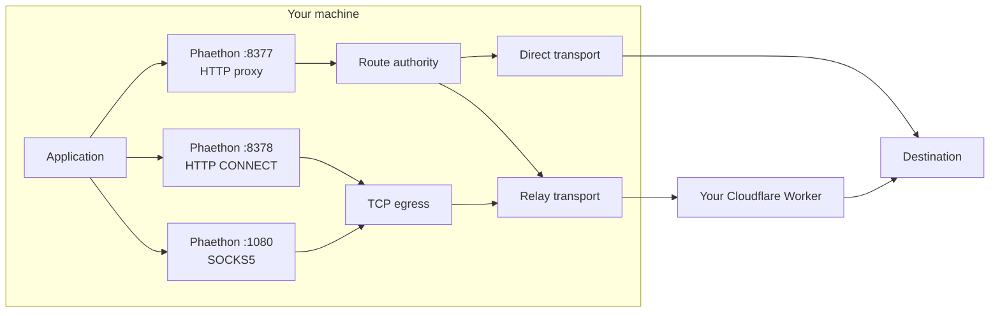
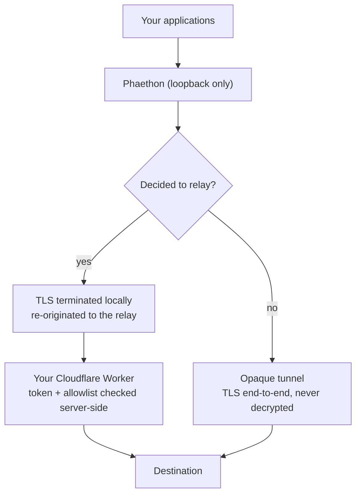

# Architecture

## Shape

Phaethon is one local process with two listeners and one decision point.

Two things are deliberately separate and must stay that way:

- **The HTTP plane** decrypts traffic it decides to relay. It is the only part
  that ever terminates TLS.
- **The TCP plane** is byte-transparent. It never inspects payloads, so SSH and
  in-protocol TLS pass through with end-to-end encryption intact.

## Components

| Component | Responsibility |
| --- | --- |
| `internal/proxy` | HTTP listener, CONNECT interception, streaming, the route decision point |
| `internal/route` | Static route table. Configuration, always wins |
| `internal/autoroute` | Leases, the Fairy oracle, relay eligibility |
| `internal/transport` | Direct and relay wire transports |
| `internal/dial` | Address-level dialing with per-address failover |
| `internal/mitm` | Local certificate authority and leaf generation |
| `internal/tcpegress` | Authenticated WebSocket transport for raw TCP |
| `internal/socks5` | Loopback SOCKS5 frontend (CONNECT only) |
| `internal/connectproxy` | Loopback HTTP CONNECT frontend |
| `internal/provision` | Cloudflare Worker deployment, OAuth and API-token paths |
| `internal/host` | The only platform-specific code: proxy, trust, startup, paths |
| `internal/speedtest`, `internal/sshdiag` | Read-only measurement |

## Control and data plane

**Control plane** — deciding. Static rules, leases, Fairy diagnosis, provisioning,
health checks. Runs once per destination per lease lifetime.

**Data plane** — carrying. A map lookup, then a tunnel or a relayed request. It
does not diagnose; a diagnosis per request would be both slow and a privacy
problem, since it would mean probing the network on the user's behalf
continuously.

## Trust boundaries

Three boundaries matter:

1. **Loopback only.** Every listener refuses to bind a non-loopback address.
2. **The relay decides.** The allowlist is enforced in the Worker, not only in
   the client, so a client-side bypass gains nothing.
3. **Local credentials are separate from relay credentials.** A process that
   reads the local proxy credential cannot reach the relay directly.

Detail in [TRUST-AND-SECURITY.md](TRUST-AND-SECURITY.md).

## Platform boundary

Routing, diagnosis, transports, provisioning and the command line are
OS-agnostic. Exactly four things are platform-specific, and they live behind
`internal/host`:

proxy configuration, certificate trust, login startup, and state paths.

Nothing in the networking core branches on the operating system. If a platform
cannot automate one of those four, it reports `MANUAL` rather than failing,
because the daemon still serves on loopback for any application to use.
