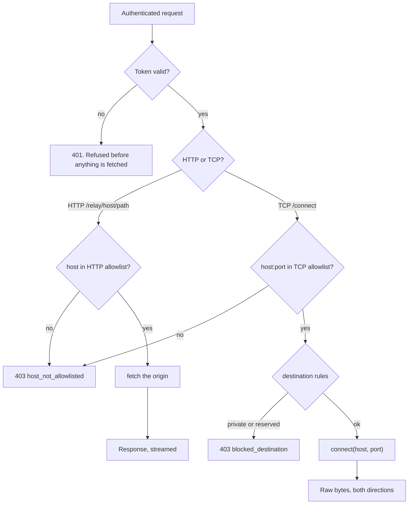

# Relay

The relay is a Cloudflare Worker that carries traffic the direct path cannot.
It is deployed into **your** Cloudflare account, so it belongs to you rather than
to whoever built Phaethon.

## What it does

## Authentication

A shared secret is required on every request, compared in constant time. A
request without it is refused before any fetch happens. Each installation
generates its own secret; nothing is shared between installations.

For TCP, the token is checked **before the WebSocket upgrade**, so an
unauthorized client never receives a socket at all.

## The allowlist is enforced here, not in the client

This is the property that keeps the relay from being an open proxy. A client-side
check proves nothing: anyone who knows the URL gains nothing, because anything
outside the list is refused by the Worker.

Two separate lists, deliberately:

| List | Entry form | Because |
| --- | --- | --- |
| HTTP | `host`, `*.suffix` | One protocol, one port |
| TCP | `host:port`, `*.suffix:port` | A host alone would allow every port |

## Provisioning

Four paths, all producing the same Worker:

| Method | Needs | Notes |
| --- | --- | --- |
| Browser authorization | A registered OAuth client | Authorization Code with PKCE, no secret to paste |
| API token | A token with Workers Scripts Write | For scripted installs |
| Adopt existing | A URL and secret | Verifies before adopting |
| Deploy it yourself | Any tooling | `--dump-relay` writes a complete project |

No credentials are embedded in Phaethon. An embed would mean every installation
shared one Cloudflare client.

## Failure modes

| Symptom | Cause |
| --- | --- |
| `401 unauthorized` | Local and deployed secrets differ |
| `403 host_not_allowlisted` | The destination is not in the list |
| `403 blocked_destination` | A private, reserved or metadata address |
| `connect_failed` | The Worker reached the allowlist but the destination refused |
| Verify loops then fails | The secret had not propagated, or the relay is not serving |

## Operational limits

- **Port 25 is refused** by Cloudflare. There is no SMTP path.
- **Cloudflare IP ranges are refused** for outbound TCP.
- **A Worker cannot connect to itself.**
- TCP sockets cannot be created in global scope, and each open socket counts
  toward the invocation's simultaneous-connection limit.
- The Worker streams; it never buffers a body to measure it.
