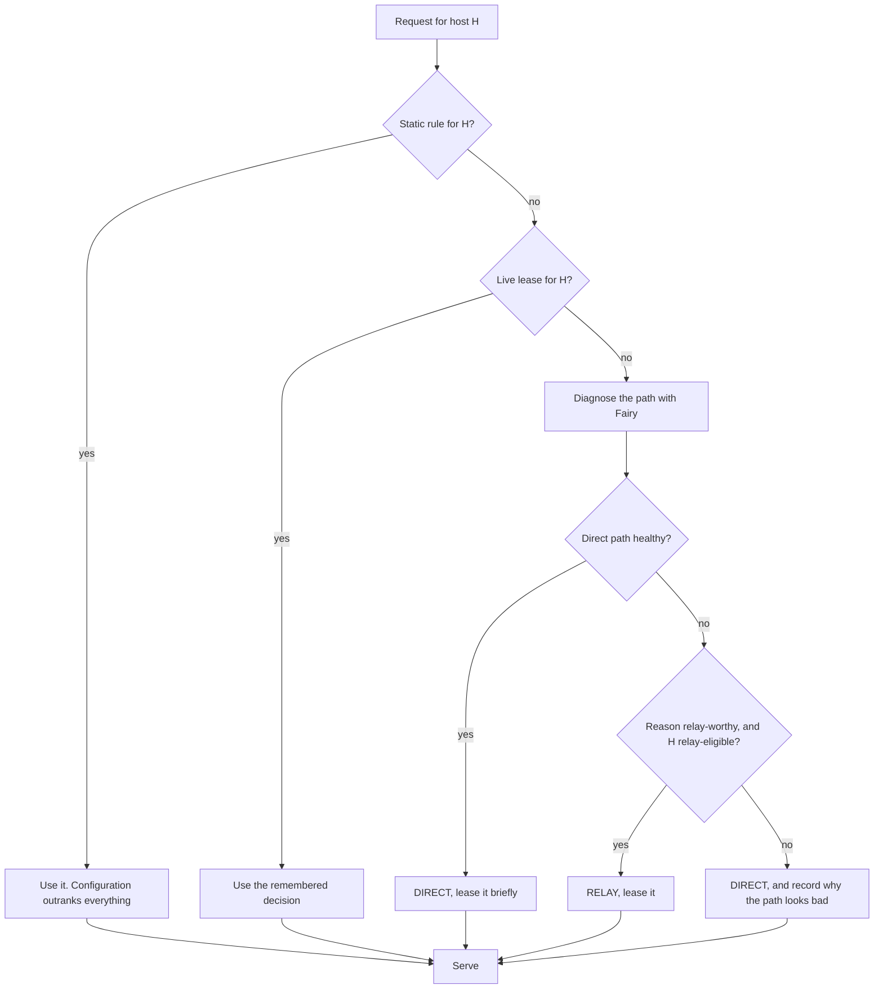

# Routing

## Decision order

## Leases

A lease is a decision plus the evidence for it, with an expiry.

| State | Meaning | Typical life |
| --- | --- | --- |
| `direct_verified` | The direct path was measured healthy | 5 minutes |
| `relay_candidate` | Relay chosen, not yet proven by a successful request | 30 seconds |
| `relay_verified` | A relayed request succeeded | 15 minutes |
| stale grace | Expired, still served while revalidation runs | 30 seconds |

Leases expire because networks change. A host that is intercepted today may be
clean tomorrow; remembering forever would keep relaying traffic that no longer
needs it.

## What justifies a relay

Fairy's findings are the only input, and only some of them justify intervening:

| Finding | Relay? | Why |
| --- | --- | --- |
| `tls_specific_failure` | **yes** | TCP works, the handshake does not. This is the signature the design exists for |
| `possible_proxy_interference` | **only with a failed handshake** | "Possible" alone is not evidence |
| `dns_failure` | **yes**, at confirmed or likely | The relay resolves at the edge |
| `tcp_unreachable` | no | Ambiguous. The host may simply be down, and a relay would gain nothing |
| `partial_address_failure` | no | Per-address failover already handles it |
| `ipv6_path_failure` | no | IPv4 works, and failover prefers it |
| `quic_unavailable`, `udp_unavailable` | no | UDP being blocked says nothing about TCP |
| `http_application_rejection` | no | An application answered. That is not a path problem |
| `path_healthy` | no | — |

The list is enforced in code, not by convention.

## A failed relay does not fall back to direct

If a relayed request fails, the decision **stays RELAY** and is demoted to a
candidate with a short life. Falling back to direct would send the request into
the very interference the relay exists to bypass, and the user would see a
certificate error rather than a clear failure.

## Relay eligibility

Being relay-worthy is not sufficient; the host must also be eligible. Eligibility
is an explicit list of patterns in configuration. A host that is not eligible is
reported as broken and left direct, never silently rerouted — an unreviewed
automatic reroute is how a selective proxy becomes a full tunnel by accident.
