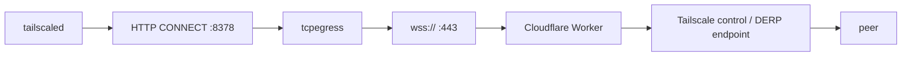

# Tailscale

## Scope, stated plainly

Phaethon can carry Tailscale's **control plane and DERP relay traffic**, because
those are TCP on port 443. It **cannot** provide Tailscale's native transport,
because that is WireGuard over UDP and Phaethon's relay carries TCP.

The practical consequence: on a network that blocks WireGuard's UDP, a tailnet
runs **DERP-relayed only**. It connects, peers can reach each other, and
`tailscale status` is healthy — but every packet takes the long way:



This is a relay inside a relay. Expect hundreds of milliseconds rather than tens.

## What this is good for

- Control-plane connectivity so the node is present and addressable
- DERP-relayed peer reachability: SSH, HTTP, RDP, administrative access
- Any workload where working slowly beats not working

## What it is not good for

- **Interactive streaming.** Video and audio in game-streaming and remote-desktop
  products are UDP and bandwidth-hungry. A stream may negotiate and then collapse
  when the control channel times out. Measured behaviour: a session established,
  negotiated an encoder, ran roughly thirty seconds, then died on a ping timeout.
- **Any expectation of native WireGuard performance.**
- **UDP in general.** If a protocol needs UDP on the wire, TCP egress cannot
  carry it.

## How it is wired

The Windows Tailscale service reads its proxy from its process environment, so
Phaethon owns that setting:

```powershell
phaethon tailscale status     # read-only; reports ownership and what it replaced
phaethon tailscale enable     # snapshots the original, then applies (needs administrator)
phaethon tailscale disable    # restores exactly what was there before
```

The original value is captured **including the fact that it was absent**, because
absent and empty restore differently and one of them leaves a service with an
environment it never had. `disable` restores exactly.

## Startup ordering — the part that bites

A Windows service starts at boot, before anyone logs in. A user process starts at
logon. So a proxy started at logon is **too late**: Tailscale comes up first,
finds nothing on the proxy port, fails to reach its coordination server, and
stays unreachable.

The fix is an SCM service dependency, so Windows itself will not start Tailscale
until the proxy is running:

```powershell
# Read the current list first, and merge rather than replace.
(Get-ItemProperty 'HKLM:\SYSTEM\CurrentControlSet\Services\Tailscale').Dependencies
```

**Status: experimental.** The dependency plumbing is not implemented, and the
boot-order path has not been proven across a reboot. Until then, Tailscale must
be started after the proxy by hand.

## Rollback

```powershell
phaethon tailscale disable      # restore the service environment (needs administrator)
Restart-Service Tailscale
```

Tailscale returns to whatever it was doing before, which on a filtered network
means it will not reach its coordination server.

## Being honest about the claim

Phaethon does not "make Tailscale work". It gives Tailscale a TCP path where its
native UDP path does not exist, which is enough for DERP-relayed connectivity and
not enough for native performance.
