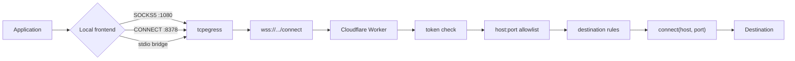

# TCP egress

Phaethon carries arbitrary approved TCP through the same authenticated relay it
uses for HTTP. Nothing in this path parses the payload, so SSH, database wire
protocols and in-protocol TLS pass through with encryption intact.

## The chain



## Three local interfaces, one transport

| Interface | Command | For |
| --- | --- | --- |
| SOCKS5 | `phaethon socks` | Anything with a SOCKS setting. CONNECT only |
| HTTP CONNECT | `phaethon connect-proxy` | Applications that speak HTTP proxy, including `tailscaled` |
| stdio bridge | `phaethon socks-connect <host> <port>` | Tools that take a command rather than a proxy setting, such as OpenSSH's `ProxyCommand` |

All three share the allowlist, the destination rules, authentication and the
relay. Only the local framing differs, which is why none of them is a special
case.

## The allowlist is host:port, and empty by default

This is the difference between a constrained egress and an open tunnel:

- An HTTP allowlist entry names a host and implies one protocol on one port.
- Under TCP the same entry would mean **that host on every port**.

So TCP destinations are a separate list, entries carry a port, a bare host is
**refused** rather than treated as every port, and the default is empty —
fail closed. The list lives in configuration as `relay_tcp_allowlist` and is
reproduced on every redeploy.

```json
{
  "relay": {
    "url": "https://relay.example.workers.dev",
    "relay_tcp_allowlist": [
      "ssh.github.com:443",
      "*.example.com:22"
    ]
  }
}
```

## Destination rules are enforced twice

The Worker refuses loopback, link-local, private, carrier-grade NAT, reserved and
metadata addresses itself. Cloudflare also refuses private addresses, but that is
platform hygiene rather than policy: it can change, it cannot see what a name
resolves to, and it knows nothing about your intent. The Worker applies
Phaethon's own rules, and the local frontends refuse the same set before the
relay is asked at all.

Port 25 is refused by Cloudflare and unreachable.

## Half-close is preserved

WebSocket has no half-close, so it is carried in-band as a control frame in each
direction. This is not a detail: SSH and SFTP finish writing and still expect to
read the reply. A pump that tears both directions down on the first EOF truncates
that reply, and the client hangs rather than erroring.

Both the WebSocket and the destination socket are opened with `allowHalfOpen`.
Setting it on one side only produces exactly the half-broken behaviour it exists
to prevent.

## Backpressure

WebSocket `send()` has no readiness signal. Without a threshold, a fast
destination and a slow client grow the buffer until the isolate's memory limit
is reached, which reaches the user as a tunnel that mysteriously breaks on large
transfers. The return path pauses when the send buffer is large, and the write
path waits on the socket's own backpressure.

## Limits you will meet

| Limit | Consequence |
| --- | --- |
| **TCP only** | UDP-based protocols cannot be carried. See [TAILSCALE.md](TAILSCALE.md) |
| Workers CPU budget | Fine for interactive use; sustained bulk transfer is CPU-bound in the Worker's copy path |
| Relay latency | Every byte crosses two extra hops. Expect tens to hundreds of milliseconds added |
| Concurrent connections | A Worker invocation has a limited number of simultaneous outbound connections |

## Verifying it independently

The relay answers `/health` with the source fingerprint it was built from, so a
deployment can be compared with the working tree rather than assumed to match
it. `phaethon doctor` reports whether the configured relay is healthy and
authenticating.
